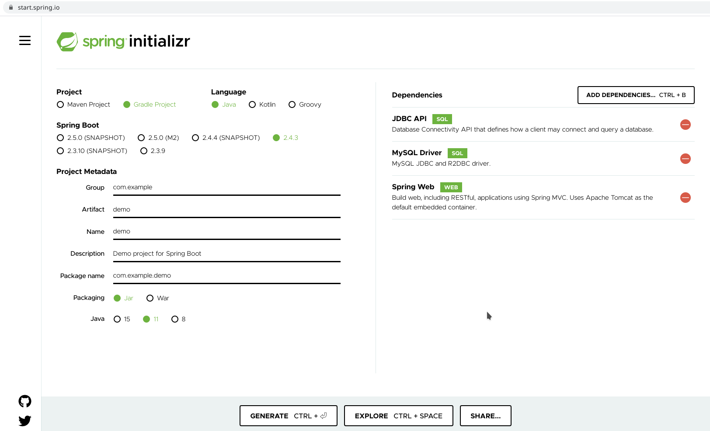
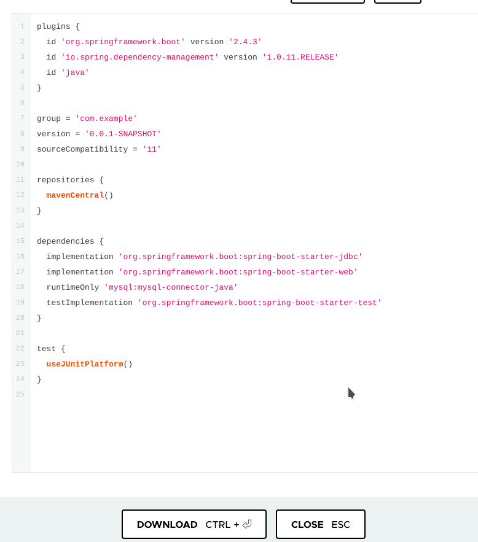
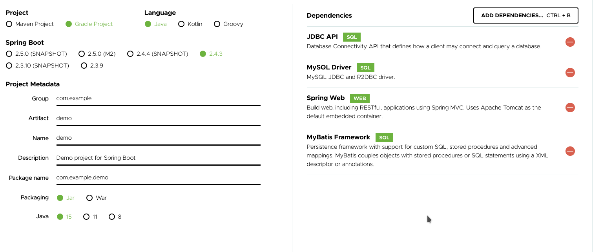
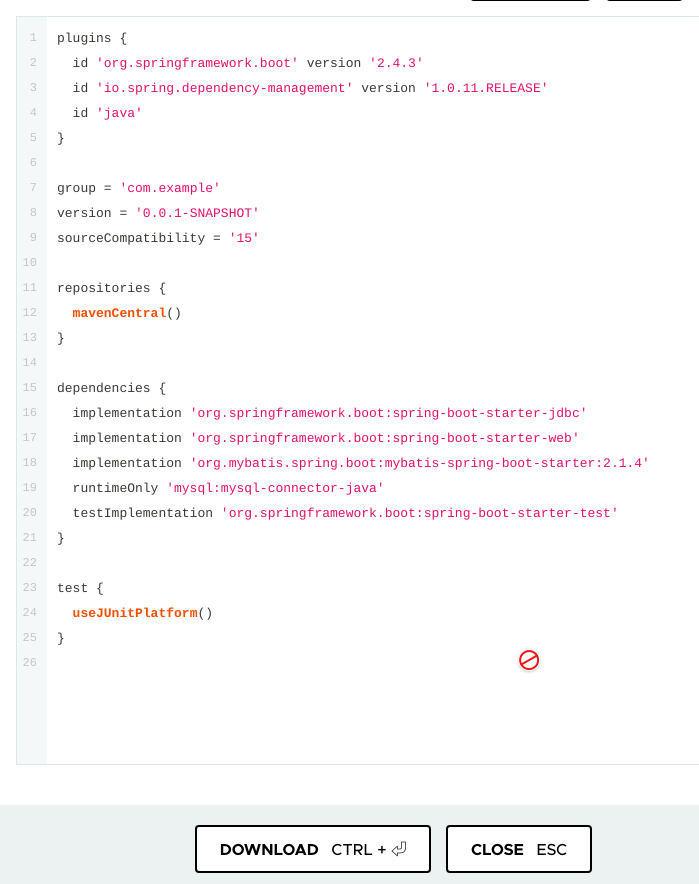
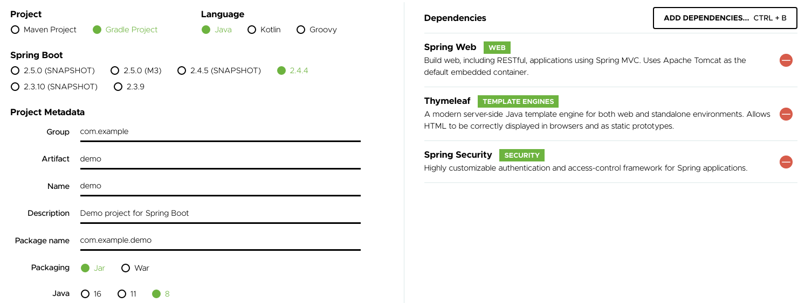
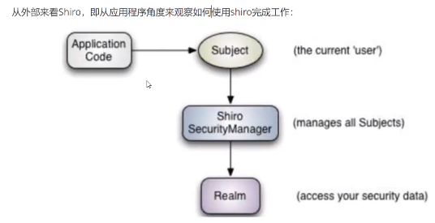
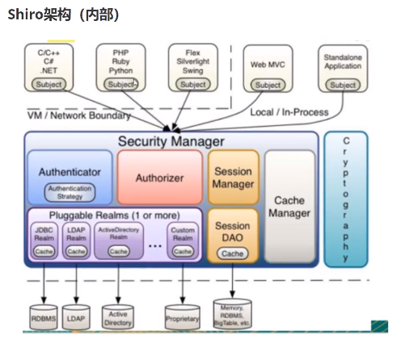
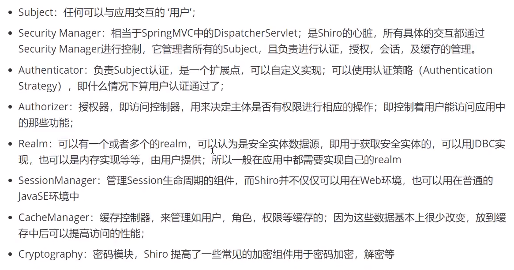
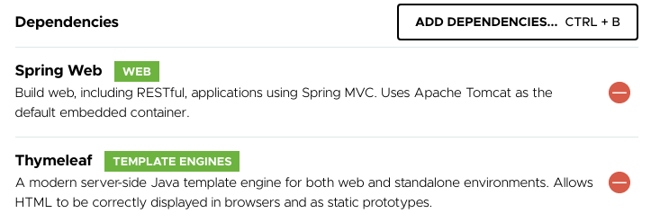

```
readme.md

:Author: kalipy
:Email: kalipy@debian
:Date: 2021-03-15 15:07
```

### springboot源码阅读

1. 方法一(失败，因为springboot的依赖有很多父子依赖，这样下载的并不是真正的源码):  
    通过gradle的build.gradle中添加:`testImplementation 'org.springframework.boot:spring-boot-starter-web:2.4.3:sources'`


2. 方法二(通过github下载,ok):  
    下载地址: `https://github.com/spring-projects/spring-boot/tree/2.4.x`

### p14-15静态资源探究

#### 根据源码理解静态资源目录

1. `vim (fzf)`找到`WebMvcAutoConfiguration.java`并打开,找到如下方法:  
    ```
    @Override
    protected void addResourceHandlers(ResourceHandlerRegistry registry) {
    	super.addResourceHandlers(registry);
    	if (!this.resourceProperties.isAddMappings()) {
    		logger.debug("Default resource handling disabled");
    		return;
    	}
    	ServletContext servletContext = getServletContext();
    	addResourceHandler(registry, "/webjars/**", "classpath:/META-INF/resources/webjars/");
    	addResourceHandler(registry, this.mvcProperties.getStaticPathPattern(), (registration) -> {
    		registration.addResourceLocations(this.resourceProperties.getStaticLocations());
    		if (servletContext != null) {
    			registration.addResourceLocations(new ServletContextResource(servletContext, SERVLET_LOCATION));
    		}
    	});
    }
    ```

#### 总结：

1. 在springboot中，我们可以用一下方式处理静态资源  
    webjars `localhost:8080/webjars/`  
    public,static,/**,resources `localhost:8080/`  

2. 优先级: resouces > static(默认) > public  

3. 在templates目录下的所有页面，只能通过controller来跳转  

### thymeleaf

1. 导入依赖:`implementation 'org.springframework.boot:spring-boot-starter-thymeleaf'`(通过`https://start.spring.io/`选上spring web和thymeleaf,然后点击expose按钮查看spirng官网自动生成的build.gradle文件中的依赖,把依赖复制到我们的这个项目里)

2. thymeleaf的templates目录解析原理,请查看源码`ThymeleafProperties.java`:
    ```
    public static final String DEFAULT_PREFIX = "classpath:/templates/";
    public static final String DEFAULT_PREFIX = ".html";
    ```

3. 导入依赖后，我们将html放在templates目录下即可使用thymeleaf模板引擎的功能了  

4. 在`.html`文件中使用thymeleaf的时候请注意在`.html`中导入约束`<html xmlns:th=http://www.thymeleaf.org>`  


### mvc配置原理(请看雷神的gradle_xx_springboot_leifenyan)

### 扩展springMvc

#### 自定义视图解析器进行路由跳转
1. src/main/java/com/ly/config/MyMvcConfig.java
    ```
    //如果我们要扩展springmvc，官方建议我们这样做!
    @Configuration
    public class MyMvcConfig implements WebMvcConfigurer {
        //视图跳转
        @Override
        public void addViewControllers(ViewControllerRegistry registry) {
            registry.addViewController("kuang").setViewName("test");
        }
    }
    ```

2. 在springboot中，有非常多的xxxConfiguration帮助我们进行扩展配置，只要看到这些东西，我们就要注意一下  

#### 自定义拦截器进行路由拦截
1. src/main/java/com/ly/config/LoginHandlerInterceptor.java
    ```
    public class LoginHandlerInterceptor implements HandlerInterceptor() {
        @Override
        public boolean preHandle(HttpServletRequest req, HttpServletResponse resp, Object handler) throws Exception {
            //登录成功之后，应该有用户的session
            Object loginUser = req.getSession().getAttribute("loginUser");

            if (loginUser==null) {
                req.setAttribute("msg", "没有权限，请先登录");
                req.getRequestDispatcher("/index.html").forward(req, resp);
                return false;
            } else {
                return true;
            }
        }
    }
    ```

2. src/main/java/com/ly/config/MyMvcConfig.java
    ```
    @Configuration
    public class MyMvcConfig implements WebMvcConfigurer {
        @Override
        public void addInterceptors(InterceptorRegistry registry) {
            registry.addInterceptor(new LoginHandlerInterceptor())
            .addPathPatterns("/**")
            .excludePathPatterns("/index.html", "/", "/user/login", "/css/*", "/js/**", "/img/**");
        }
    }
    ```

### springboot整合jdbc
1. 选上jdbc和mysql驱动
     

2. 点击explore按钮
   

3. 把jdbc和mysql驱动依赖复制到我们的项目里
    ```
    implementation 'org.springframework.boot:spring-boot-starter-jdbc'
    runtimeOnly 'mysql:mysql-connector-java'
    ```

4. 编写`application.yml`
    ```
    spring:
        datasource:
            username: root
            password: Abcd1234
            url: jdbc:mysql://127.0.0.1:3306/mybatis?serverTimezone=UTC&useUnicode=true&characterEncoding=utf-8
            driver-class-name: com.mysql.cj.jdbc.Driver
    ```

5. sql单元测试(注意: 1.javacomplete2不能代码提示自动导入import DataSource,这个换个jdk版本就可以了 2.Connection这个包javacomplete2无论如何都不能自动导入，这时只能百度关键字`java import Connection`,然后找到Connection是位于java.sql.包下，然后手动导入import java.sql.Connection)
    ```
    package com.example.demo;
    
    import javax.sql.DataSource;
    import java.sql.Connection;
    import org.junit.jupiter.api.Test;
    import org.springframework.beans.factory.annotation.Autowired;
    import org.springframework.boot.test.context.SpringBootTest;
    
    @SpringBootTest
    class DemoApplicationTests {
        @Autowired
        DataSource dataSource;
    
        @Test
        void contextLoads() throws Exception {
            //打印一下默认的数据源
            System.out.println(dataSource.getClass());
            //获取数据库连接
            Connection conn = dataSource.getConnection();
            System.out.println(conn);
    
            conn.close();
        }
    }
    ```

6. 编写控制层代码
    ```
    package com.example.demo.controller;
    
    import java.util.List;
    import java.util.Map;
    import org.springframework.beans.factory.annotation.Autowired;
    import org.springframework.jdbc.core.JdbcTemplate;
    import org.springframework.web.bind.annotation.GetMapping;
    import org.springframework.web.bind.annotation.PathVariable;
    import org.springframework.web.bind.annotation.RestController;
    
    /*
     * JDBCController.java
     * Copyright (C) 2021 2021-03-15 18:25 kalipy <kalipy@debian>
     *
     * Distributed under terms of the MIT license.
     */
    
    @RestController
    public class JDBCController
    {
       @Autowired
       JdbcTemplate jdbcTemplate;
    
       //查询数据库所有信息
       //没有实体类，数据库中的东西，怎么获取? Map
       @GetMapping("/userList")
       public List<Map<String, Object>> userList() {
            String sql = "select * from user";
            List<Map<String, Object>> list_maps = jdbcTemplate.queryForList(sql);
            return list_maps;
       }
    
       @GetMapping("/addUser")
       public String addUser() {
           String sql = "insert into mybatis.user(id, name, pwd) values (4, '小明', '123456')";
           jdbcTemplate.update(sql);
           return "update-ok";
       }
       
       @GetMapping("/updateUser/{id}")
       public String updateUser(@PathVariable("id") int id) {
           String sql = "update mybatis.user set name=?,pwd=? where id=" + id;
           //封装
           Object[] objects = new Object[2];
           objects[0] = "小明2";
           objects[1] = "123456";
           jdbcTemplate.update(sql, objects);
           return "updateUser-ok";
       }
       
       @GetMapping("/deleteUser/{id}")
       public String deleteUser(@PathVariable("id") int id) {
           String sql = "delete from mybatis.user where id = ?";
           jdbcTemplate.update(sql, id);
           return "deleteUser-ok";
       }
    }
    
    ```

7. 测试`gradle bootRun`,访问`127.0.0.1/userList`

### 整合Druid数据源

1. 只需导入`druid`依赖和在`application.yml`中添加一行`type: com.alibaba.druid.pool.DruidDataSource`即可
    ```
    kalipy@debian ~/b/j/k/demo> git diff 
    diff --git a/demo/build.gradle b/demo/build.gradle
    index 702628b..268e594 100644
    --- a/demo/build.gradle
    +++ b/demo/build.gradle
    @@ -29,6 +29,7 @@ dependencies {
         testImplementation 'org.springframework.boot:spring-boot-starter-test'
         
         implementation 'org.springframework.boot:spring-boot-starter-thymeleaf'
    +    implementation 'com.alibaba:druid:1.1.21'
     }
     
     test {
    diff --git a/demo/src/main/resources/application.yml b/demo/src/main/resources/application.yml
    index 25f0529..3472c90 100644
    --- a/demo/src/main/resources/application.yml
    +++ b/demo/src/main/resources/application.yml
    @@ -4,3 +4,4 @@ spring:
             password: Abcd1234
             url: jdbc:mysql://127.0.0.1:3306/mybatis?serverTimezone=UTC&useUnicode=true&characterEncoding=utf-8
             driver-class-name: com.mysql.cj.jdbc.Driver
    +        type: com.alibaba.druid.pool.DruidDataSource
    ```

### 整合mybatis

1. 选上如下东西:  
    

2. 点击explore按钮  
   

3. 编写`application.properties`,整合mybatis
    ```
    spring.datasource.username=root
    spring.datasource.password=Abcd1234
    spring.datasource.url=jdbc:mysql://127.0.0.1:3306/mybatis?serverTimezone=UTC&useUnicode=true&characterEncoding=utf-8
    spring.datasource.driver-class-name=com.mysql.cj.jdbc.Driver
    
    # 整合mybatis
    mybatis.type-aliases-package=com.kuang.pojo # mybatis的包扫描
    mybatis.mapper-locations=classpath:mybatis/mapper/*.xml # mybatis的xml的存放路径 可以在resources文件夹下建个mybatis目录，再在mybatis目录下建个mapper目录，在mapper目录下编写.xml配置文件
    ```

4. 编写pojo

5. 编写接口`xxMapper`,比如:
    ```
    //这个注解表示这是一个mybatis的mapper类: Dao
    @Mapper
    @Reqository
    public interface UserMapper {
        List<User> queryUserList();

        User queryUserById(int id);
    }
    ```

6. 编写mybatis xxMapper接口对应的.xml配置文件

7. 编写控制层
    ```
    @RestController
    public class UserController {
        @AutoWired
        private UserMapper userMapper;

        @GetMapping("queryUserList")
        public List<User> userList = userMapper.queryUserList();
        for (User user : userList) {
            System.out.println(user);
        }
        return userList;
    }
    ```

### SpringSecurity

#### 什么是springsecurity?

Spring Security是一个能够为基于Spring的企业应用系统提供声明式的安全访问控制解决方案的安全框架。它提供了一组可以在Spring应用上下文中配置的Bean，充分利用了Spring IoC，DI（控制反转Inversion of Control ,DI:Dependency Injection 依赖注入）和AOP（面向切面编程）功能，为应用系统提供声明式的安全访问控制功能，减少了为企业系统安全控制编写大量重复代码的工作。

#### 功能(认证 授权)

* 功能权限

* 访问权限

* 菜单权限

* 拦截器，过滤器:大量原生代码冗余

Spring Security对Web安全性的支持大量地依赖于Servlet过滤器。这些过滤器拦截进入请求，并且在应用程序处理该请求之前进行某些安全处理。 Spring Security提供有若干个过滤器，它们能够拦截Servlet请求，并将这些请求转给认证和访问决策管理器处理，从而增强安全性。根据自己的需要，可以使用适当的过滤器来保护自己的应用程序。

如果使用过Servlet过滤器且令其正常工作，就必须在Web应用程序的web.xml文件中使用<filter> 和<filter-mapping>元素配置它们。虽然这样做能起作用，但是它并不适用于使用依赖注入进行的配置。

FilterToBeanProxy是一个特殊的Servlet过滤器，它本身做的工作并不多，而是将自己的工作委托给Spring应用程序上下文 中的一个Bean来完成。被委托的Bean几乎和其他的Servlet过滤器一样，实现javax.servlet.Filter接口，但它是在Spring配置文件而不是web.xml文件中配置的。

实际上，FilterToBeanProxy代理给的那个Bean可以是javax.servlet.Filter的任意实现。这可以是 Spring Security的任何一个过滤器，或者它可以是自己创建的一个过滤器。但是正如本书已经提到的那样，Spring Security要求至少配置四个而且可能一打或者更多的过滤器。

#### 简介

只需要引入`spring-boot-starter-security`模块，进行少量的配置，即可实现强大的安全管理

记住几个类:

* WebSecurityConfigurerAdapter: 自定义安全策略

* AuthenticationManagerBuilder: 自定义认证策略

* @EnableWebSecurity: 开启WebSecurity模式

Spring Security的两个主要目标是`认证(Authentication)`和`授权(Authorization)`(访问控制)

### [实战]不同角色登录有不同的访问控制权限

#### 导入依赖



    plugins {
    	id 'org.springframework.boot' version '2.4.4'
    	id 'io.spring.dependency-management' version '1.0.11.RELEASE'
    	id 'java'
    }
    
    group = 'com.example'
    version = '0.0.1-SNAPSHOT'
    sourceCompatibility = '1.8'

    repositories {
        maven { url 'https://maven.aliyun.com/repository/public' }
        maven { url 'https://maven.aliyun.com/repository/central'}
        maven { url 'https://maven.aliyun.com/repository/google'}
        maven { url 'https://maven.aliyun.com/repository/gradle-plugin'}
        maven { url 'https://maven.aliyun.com/repository/spring'}
        maven { url 'https://maven.aliyun.com/repository/spring-plugin'}
        maven { url 'https://maven.aliyun.com/repository/apache-snapshots'}
    
        mavenLocal()
        mavenCentral()
    }
    
    dependencies {
    	implementation 'org.springframework.boot:spring-boot-starter-security'
    	implementation 'org.springframework.boot:spring-boot-starter-thymeleaf'
    	implementation 'org.springframework.boot:spring-boot-starter-web'
    	implementation 'org.thymeleaf.extras:thymeleaf-extras-springsecurity5'
    	testImplementation 'org.springframework.boot:spring-boot-starter-test'
    	testImplementation 'org.springframework.security:spring-security-test'
    }
    
    test {
    	useJUnitPlatform()
    }

#### 项目结构如下:

    kalipy@debian ~/b/j/k/d/demo> tree src/
    src/
    ├── main
    │   ├── java
    │   │   └── com
    │   │       └── example
    │   │           └── demo
    │   │               ├── config
    │   │               │   └── SecurityConfig.java
    │   │               ├── controller
    │   │               │   └── RouterController.java
    │   │               └── DemoApplication.java
    │   └── resources
    │       ├── application.properties
    │       ├── static
    │       └── templates
    │           ├── index.html
    │           └── views
    │               ├── level1
    │               │   ├── 1.html
    │               │   ├── 2.html
    │               │   └── 3.html
    │               ├── level2
    │               │   ├── 1.html
    │               │   ├── 2.html
    │               │   └── 3.html
    │               ├── level3
    │               │   ├── 1.html
    │               │   ├── 2.html
    │               │   └── 3.html
    │               └── login.html

#### 编写控制层

RouterController.java

    package com.example.demo.controller;
    
    import org.springframework.stereotype.Controller;
    
    import org.springframework.web.bind.annotation.PathVariable;
    import org.springframework.web.bind.annotation.RequestMapping;
    
    /*
     * RouterController.java
     * Copyright (C) 2021 2021-03-22 13:38 kalipy <kalipy@debian>
     *
     * Distributed under terms of the MIT license.
     */
    @Controller
    public class RouterController
    {
        @RequestMapping({"/", "/index"})
        public String index() {
            return "index";
        }
        
        @RequestMapping("/toLogin")
        public String toLogin() {
            return "views/login";
        }
        
        @RequestMapping("/level1/{id}")
        public String level1(@PathVariable("id") int id) {
            return "views/level1/" + id;
        }
        @RequestMapping("/level2/{id}")
        public String level2(@PathVariable("id") int id) {
            return "views/level2/" + id;
        }
        @RequestMapping("/level3/{id}")
        public String level3(@PathVariable("id") int id) {
            return "views/level3/" + id;
        }
    }
    
#### 编写配置类

SecurityConfig.java

    package com.example.demo.config;
    
    import org.springframework.security.authentication.AuthenticationManager;
    import org.springframework.security.crypto.bcrypt.BCryptPasswordEncoder;
    
    import org.springframework.security.config.annotation.authentication.builders.AuthenticationManagerBuilder;
    import org.springframework.security.config.annotation.web.builders.HttpSecurity;
    import org.springframework.security.config.annotation.web.configuration.EnableWebSecurity;
    import org.springframework.security.config.annotation.web.configuration.WebSecurityConfigurerAdapter;
    
    /*
     * SecurityConfig.java
     * Copyright (C) 2021 2021-03-22 13:15 kalipy <kalipy@debian>
     *
     * Distributed under terms of the MIT license.
     */
    
    //AOP拦截器
    @EnableWebSecurity
    public class SecurityConfig extends WebSecurityConfigurerAdapter 
    {
        //授权
        @Override
        public void configure(HttpSecurity http) throws Exception {
            //首页所有人可以访问，功能页只有对应权限的人才能访问
            //请求授权的规则
            http.authorizeRequests()
                .antMatchers("/").permitAll()
                .antMatchers("/level1/**").hasRole("vip1")
                .antMatchers("/level2/**").hasRole("vip2")
                .antMatchers("/level3/**").hasRole("vip3");
    
            //没有权限默认到登录页面
            http.formLogin();
        
            //注销，开启了注销功能，跳到首页
            http.logout().logoutSuccessUrl("/");

            //开启记住我功能 cookie，默认保存两周
            http.rememberMe();
        }
    
        //认证, springboot 2.1.x可以直接使用
        //在spring security 5.0+ 需要对密码加密，不然会报错
        @Override
        public void configure(AuthenticationManagerBuilder auth) throws Exception {
            auth.inMemoryAuthentication().passwordEncoder(new BCryptPasswordEncoder())//这些数据通常应该从数据库里得到，这里为了方便我们直接从内存里面放入假数据
                .withUser("hanser").password(new BCryptPasswordEncoder().encode("123456")).roles("vip2", "vip3")
                .and()
                .withUser("root").password(new BCryptPasswordEncoder().encode("123456")).roles("vip1", "vip2", "vip3")
                .and()
                .withUser("yousa").password(new BCryptPasswordEncoder().encode("123456")).roles("vip1");
        }
    }

#### 测试

浏览器访问`http://127.0.0.1:8080/levelx/y`,会自动跳转到springboot自带的login页面，我们输入hanser或root或yousa的账号进行登录后，不同角色有不同的页面访问权限

### Shiro

#### 什么是Shiro?

Apache Shiro是一个强大且易用的Java安全框架,执行身份验证、授权、密码和会话管理。使用Shiro的易于理解的API,您可以快速、轻松地获得任何应用程序,从最小的移动应用程序到最大的网络和企业应用程序。

#### 主要功能

三个核心组件：Subject, SecurityManager 和 Realms.
Subject：即“当前操作用户”。但是，在Shiro中，Subject这一概念并不仅仅指人，也可以是第三方进程、后台帐户（Daemon Account）或其他类似事物。它仅仅意味着“当前跟软件交互的东西”。

Subject代表了当前用户的安全操作，SecurityManager则管理所有用户的安全操作。

SecurityManager：它是Shiro框架的核心，典型的Facade模式，Shiro通过SecurityManager来管理内部组件实例，并通过它来提供安全管理的各种服务。

Realm： Realm充当了Shiro与应用安全数据间的“桥梁”或者“连接器”。也就是说，当对用户执行认证（登录）和授权（访问控制）验证时，Shiro会从应用配置的Realm中查找用户及其权限信息。

从这个意义上讲，Realm实质上是一个安全相关的DAO：它封装了数据源的连接细节，并在需要时将相关数据提供给Shiro。当配置Shiro时，你必须至少指定一个Realm，用于认证和（或）授权。配置多个Realm是可以的，但是至少需要一个。

Shiro内置了可以连接大量安全数据源（又名目录）的Realm，如LDAP、关系数据库（JDBC）、类似INI的文本配置资源以及属性文件等。如果系统默认的Realm不能满足需求，你还可以插入代表自定义数据源的自己的Realm实现。







### Springboot整合Shiro环境搭建

#### 快速开始



#### 导入Shiro依赖

	implementation 'org.apache.shiro:shiro-spring:1.4.1'

#### 代码结构如下

    kalipy@debian ~/b/j/k/d/demo> tree src/
    src/
    ├── main
    │   ├── java
    │   │   └── com
    │   │       └── example
    │   │           └── demo
    │   │               ├── config
    │   │               │   ├── ShiroConfig.java
    │   │               │   └── UserRealm.java
    │   │               ├── controller
    │   │               │   └── MyController.java
    │   │               └── DemoApplication.java
    │   └── resources
    │       ├── application.properties
    │       ├── static
    │       └── templates
    │           ├── index.html
    │           └── user
    │               ├── add.html
    │               └── update.html

#### 编写配置类

UserRealm.java

    package com.example.demo.config;
    
    import org.apache.shiro.authc.AuthenticationException;
    import org.apache.shiro.authc.AuthenticationInfo;
    import org.apache.shiro.authc.AuthenticationToken;
    import org.apache.shiro.authz.AuthorizationInfo;
    import org.apache.shiro.realm.AuthorizingRealm;
    import org.apache.shiro.subject.PrincipalCollection;
    
    /*
     * UserRealm.java
     * Copyright (C) 2021 2021-03-22 17:03 kalipy <kalipy@debian>
     *
     * Distributed under terms of the MIT license.
     */
    
    //自定义的UserRealm
    public class UserRealm extends AuthorizingRealm
    {
        //授权
        @Override 
        protected AuthorizationInfo doGetAuthorizationInfo(PrincipalCollection principals)
        {
            System.out.println("执行了授权方法..");
            return null;
        }
    
        //认证
        @Override 
        protected AuthenticationInfo doGetAuthenticationInfo(AuthenticationToken token) throws AuthenticationException {
            System.out.println("执行了认证方法..");
            return null;
        }
    }

编写ShiroConfig.java

    package com.example.demo.config;
    
    import org.apache.shiro.spring.web.ShiroFilterFactoryBean;
    
    import org.apache.shiro.web.mgt.DefaultWebSecurityManager;
    
    import org.springframework.beans.factory.annotation.Qualifier;
    
    import org.springframework.context.annotation.Bean;
    import org.springframework.context.annotation.Configuration;
    
    /*
     * ShiroConfig.java
     * Copyright (C) 2021 2021-03-22 17:01 kalipy <kalipy@debian>
     *
     * Distributed under terms of the MIT license.
     */
    @Configuration
    public class ShiroConfig
    {
        //ShiroFilterFactoryBean
        @Bean
        public ShiroFilterFactoryBean getShiroFilterFactoryBean(@Qualifier("securityManager") DefaultWebSecurityManager defaultWebSecurityManager) {
            ShiroFilterFactoryBean bean = new ShiroFilterFactoryBean();
            //设置安全管理器
            bean.setSecurityManager(defaultWebSecurityManager);
            return bean;
        }
        //DefaultWebSecurityManager
        @Bean(name="securityManager")
        public DefaultWebSecurityManager getDefaultWebSecurityManager(@Qualifier("userRealm") UserRealm userRealm) {
            DefaultWebSecurityManager securityManager = new DefaultWebSecurityManager();
            //关联UserRealm
            securityManager.setRealm(userRealm);
            return securityManager;
        }
    
        //创建realm对象,需要自定义类
        @Bean
        public UserRealm userRealm() {
            return new UserRealm();
        }
    }

#### 编写控制层

MyController.java

    package com.example.demo.controller;
    
    import org.springframework.stereotype.Controller;
    import org.springframework.ui.Model;
    
    import org.springframework.web.bind.annotation.RequestMapping;
    
    /*
     * MyController.java
     * Copyright (C) 2021 2021-03-22 17:24 kalipy <kalipy@debian>
     *
     * Distributed under terms of the MIT license.
     */
    @Controller
    public class MyController
    {
        @RequestMapping({"/", "/index"}) 
        public String toIndex(Model model) {
            model.addAttribute("msg", "hello Shiro");
            return "index";
        }
        @RequestMapping("/user/add") 
        public String add() {
            return "user/add";
        }
        @RequestMapping("/user/update") 
        public String update() {
            return "user/update";
        }
    }

#### 前端页面

index.html

    <!DOCTYPE html>
    <html lang="en" xmlns:th="http://www.thymeleaf.org">
    	<head>
            <meta charset="utf-8" />
    		<title>Index</title>
    	</head>
    	<body>
    	    <p th:text="${msg}"></p>
            <br>
            <a th:href="@{/user/add}">add</a>
            <a th:href="@{/user/update}">update</a>
    	</body>
    </html>

### Shiro登录拦截

#### 代码编写

自己看git与上次(Springboot整合Shiro环境搭建)的对比

    kalipy@debian ~/b/j/k/d/demo> git diff HEAD
    diff --git a/demo_shiro/demo/src/main/java/com/example/demo/config/ShiroConfig.java b/demo_shiro/demo/src/main/java/com/example/demo/config/ShiroConfig.java
    index 760f95f..23ae105 100644
    --- a/demo_shiro/demo/src/main/java/com/example/demo/config/ShiroConfig.java
    +++ b/demo_shiro/demo/src/main/java/com/example/demo/config/ShiroConfig.java
    @@ -1,5 +1,8 @@
     package com.example.demo.config;
     
    +import java.util.LinkedHashMap;
    +import java.util.Map;
    +
     import org.apache.shiro.spring.web.ShiroFilterFactoryBean;
     
     import org.apache.shiro.web.mgt.DefaultWebSecurityManager;
    @@ -24,6 +27,24 @@ public class ShiroConfig
             ShiroFilterFactoryBean bean = new ShiroFilterFactoryBean();
             //设置安全管理器
             bean.setSecurityManager(defaultWebSecurityManager);
    +
    +        //添加shiro的内置过滤器
    +        /*
    +         * anon: 无需认证就可以访问
    +         * authc: 必须认证才能访问
    +         * user: 必须拥有 记住我 功能才能用
    +         * perms: 拥有对某个资源的权限才能访问
    +         * role: 拥有某个角色权限才能访问
    +         */
    +        Map<String, String> filterMap = new LinkedHashMap<>();
    +
    +        filterMap.put("/user/add", "authc");
    +        filterMap.put("/user/update", "authc");
    +
    +        bean.setFilterChainDefinitionMap(filterMap);
    +        //设置登录页面的请求地址
    +        bean.setLoginUrl("/toLogin");
    +
             return bean;
         }
         //DefaultWebSecurityManager
    diff --git a/demo_shiro/demo/src/main/java/com/example/demo/controller/MyController.java b/demo_shiro/demo/src/main/java/com/example/demo/controller/MyController.java
    index a328ee2..d47bedb 100644
    --- a/demo_shiro/demo/src/main/java/com/example/demo/controller/MyController.java
    +++ b/demo_shiro/demo/src/main/java/com/example/demo/controller/MyController.java
    @@ -27,5 +27,9 @@ public class MyController
         public String update() {
             return "user/update";
         }
    +    @RequestMapping("/toLogin") 
    +    public String toLogin() {
    +        return "login";
    +    }
     }
     
    diff --git a/demo_shiro/demo/src/main/resources/templates/login.html b/demo_shiro/demo/src/main/resources/templates/login.html
    new file mode 100644
    index 0000000..9e151d5
    --- /dev/null
    +++ b/demo_shiro/demo/src/main/resources/templates/login.html
    @@ -0,0 +1,16 @@
    +<!DOCTYPE html>
    +<html>
    +       <head>
    +        <meta charset="utf-8" />
    +               <title>Login</title>
    +       </head>
    +       <body>
    +           <h1>登录</h1>
    +        <hr>
    +        <form action="">
    +            <p>用户名:<input type="text" name="username"></p>
    +            <p>密码:<input type="text" name="password"></p>
    +            <p><input type="submit"></p>
    +        </form>
    +       </body>
    +</html>

#### 测试

浏览器访问`http://127.0.0.1:8080/`,分别点击add 和 update的超链接，发现被拦截到登录页去了

### Shiro实现用户认证

#### 代码编写

自己看git与上次(Springboot Shiro登录拦截)的对比

    kalipy@debian ~/b/j/k/d/demo> git diff HEAD
    diff --git a/demo_shiro/demo/src/main/java/com/example/demo/config/UserRealm.java b/demo_shiro/demo/src/main/java/com/example/demo/config/UserRealm.java
    index 5d3c201..386a4fb 100644
    --- a/demo_shiro/demo/src/main/java/com/example/demo/config/UserRealm.java
    +++ b/demo_shiro/demo/src/main/java/com/example/demo/config/UserRealm.java
    @@ -3,6 +3,8 @@ package com.example.demo.config;
     import org.apache.shiro.authc.AuthenticationException;
     import org.apache.shiro.authc.AuthenticationInfo;
     import org.apache.shiro.authc.AuthenticationToken;
    +import org.apache.shiro.authc.SimpleAuthenticationInfo;
    +import org.apache.shiro.authc.UsernamePasswordToken;
     import org.apache.shiro.authz.AuthorizationInfo;
     import org.apache.shiro.realm.AuthorizingRealm;
     import org.apache.shiro.subject.PrincipalCollection;
    @@ -29,7 +31,19 @@ public class UserRealm extends AuthorizingRealm
         @Override 
         protected AuthenticationInfo doGetAuthenticationInfo(AuthenticationToken token) throws AuthenticationException {
             System.out.println("执行了认证方法..");
    -        return null;
    +
    +        //我们这里为了方便，直接不从数据库里取，而是硬编码伪造user
    +        String name = "root";
    +        String password = "123456";
    +
    +        UsernamePasswordToken userToken = (UsernamePasswordToken) token;
    +
    +        if (!userToken.getUsername().equals(name)) {
    +            return null;//会自动抛出异常(UnknownAccountException)
    +        }
    +
    +        //密码认证,shiro自动做了
    +        return new SimpleAuthenticationInfo("", password, ""); 
         }
     }
     
    diff --git a/demo_shiro/demo/src/main/java/com/example/demo/controller/MyController.java b/demo_shiro/demo/src/main/java/com/example/demo/controller/MyController.java
    index d47bedb..952a6e9 100644
    --- a/demo_shiro/demo/src/main/java/com/example/demo/controller/MyController.java
    +++ b/demo_shiro/demo/src/main/java/com/example/demo/controller/MyController.java
    @@ -1,5 +1,13 @@
     package com.example.demo.controller;
     
    +import org.apache.catalina.security.SecurityUtil;
    +
    +import org.apache.shiro.SecurityUtils;
    +import org.apache.shiro.authc.IncorrectCredentialsException;
    +import org.apache.shiro.authc.UnknownAccountException;
    +import org.apache.shiro.authc.UsernamePasswordToken;
    +import org.apache.shiro.subject.Subject;
    +
     import org.springframework.stereotype.Controller;
     import org.springframework.ui.Model;
     
    @@ -31,5 +39,23 @@ public class MyController
         public String toLogin() {
             return "login";
         }
    +    @RequestMapping("/login") 
    +    public String login(String username, String password, Model model) {
    +        //获取当前用户
    +        Subject subject = SecurityUtils.getSubject();
    +        //封装用户登录的数据
    +        UsernamePasswordToken token = new UsernamePasswordToken(username, password);
    +
    +        try {
    +            subject.login(token);//执行登录方法,会把用户信息提交到doGetAuthtication
    认证方法中校验用户信息
    +            return "index";
    +        } catch (UnknownAccountException e) {
    +            model.addAttribute("msg", "用户名错误");
    +            return "login";
    +        } catch (IncorrectCredentialsException e) {
    +            model.addAttribute("msg", "密码错误");
    +            return "login";
    +        }
    +    }
     }
     
    diff --git a/demo_shiro/demo/src/main/resources/templates/login.html b/demo_shiro/demo/src/main/resources/templates/login.html
    index 9e151d5..fd1922b 100644
    --- a/demo_shiro/demo/src/main/resources/templates/login.html
    +++ b/demo_shiro/demo/src/main/resources/templates/login.html
    @@ -1,5 +1,5 @@
     <!DOCTYPE html>
    -<html>
    +<html lang="en" xmlns:th="http://www.thymeleaf.org">
            <head>
             <meta charset="utf-8" />
                    <title>Login</title>
    @@ -7,7 +7,8 @@
            <body>
                <h1>登录</h1>
             <hr>
    -        <form action="">
    +        <p th:text="${msg}" style="color: red;"></p>
    +        <form th:action="@{/login}">
                 <p>用户名:<input type="text" name="username"></p>
                 <p>密码:<input type="text" name="password"></p>
                 <p><input type="submit"></p>

#### 测试

浏览器访问`http://127.0.0.1:8080/`,分别点击add或update的超链接跳转到登录页后，分别输入正确用户密码和错误用户名密码，查看是否可以认证成功或失败

### shiro整合mybatis

#### 代码编写

自己看git与上次(shiro实现用户认证)的对比

    kalipy@debian ~/b/j/k/d/demo> git diff HEAD
    diff --git a/demo_shiro/demo/build.gradle b/demo_shiro/demo/build.gradle
    index bd36e91..28b8f0a 100644
    --- a/demo_shiro/demo/build.gradle
    +++ b/demo_shiro/demo/build.gradle
    @@ -26,6 +26,11 @@ dependencies {
            implementation 'org.springframework.boot:spring-boot-starter-web'
            
            implementation 'org.apache.shiro:shiro-spring:1.4.1'
    +    implementation 'org.springframework.boot:spring-boot-starter-jdbc'
    +    runtimeOnly 'mysql:mysql-connector-java'
    +    implementation 'com.alibaba:druid:1.1.21'
    +    implementation 'org.mybatis.spring.boot:mybatis-spring-boot-starter:2.1.4'
    +    implementation 'log4j:log4j:1.2.17'
         
         testImplementation 'org.springframework.boot:spring-boot-starter-test'
     }
    diff --git a/demo_shiro/demo/src/main/java/com/example/demo/config/UserRealm.java b/demo_shiro/demo/src/main/java/com/example/demo/config/UserRealm.java
    index 386a4fb..6fd5cca 100644
    --- a/demo_shiro/demo/src/main/java/com/example/demo/config/UserRealm.java
    +++ b/demo_shiro/demo/src/main/java/com/example/demo/config/UserRealm.java
    @@ -9,6 +9,11 @@ import org.apache.shiro.authz.AuthorizationInfo;
     import org.apache.shiro.realm.AuthorizingRealm;
     import org.apache.shiro.subject.PrincipalCollection;
     
    +import org.springframework.beans.factory.annotation.Autowired;
    +
    +import com.example.demo.pojo.User;
    +import com.example.demo.service.UserService;
    +
     /*
      * UserRealm.java
      * Copyright (C) 2021 2021-03-22 17:03 kalipy <kalipy@debian>
    @@ -19,6 +24,9 @@ import org.apache.shiro.subject.PrincipalCollection;
     //自定义的UserRealm
     public class UserRealm extends AuthorizingRealm
     {
    +    @Autowired
    +    UserService userService;
    +
         //授权
         @Override 
         protected AuthorizationInfo doGetAuthorizationInfo(PrincipalCollection principals)
    @@ -32,18 +40,17 @@ public class UserRealm extends AuthorizingRealm
         protected AuthenticationInfo doGetAuthenticationInfo(AuthenticationToken token) throws AuthenticationException {
             System.out.println("执行了认证方法..");
     
    -        //我们这里为了方便，直接不从数据库里取，而是硬编码伪造user
    -        String name = "root";
    -        String password = "123456";
    -
             UsernamePasswordToken userToken = (UsernamePasswordToken) token;
     
    -        if (!userToken.getUsername().equals(name)) {
    +        //查询数据库
    +        User user = userService.queryUserByName(userToken.getUsername());
    +
    +        if (user == null) {
                 return null;//会自动抛出异常(UnknownAccountException)
             }
     
             //密码认证,shiro自动做了
    -        return new SimpleAuthenticationInfo("", password, ""); 
    +        return new SimpleAuthenticationInfo("", user.getPwd(), ""); 
         }
     }
     
    diff --git a/demo_shiro/demo/src/main/java/com/example/demo/mapper/UserMapper.java b/demo_shiro/demo/src/main/java/com/example/demo/mapper/UserMapper.java
    new file mode 100644
    index 0000000..6897cfb
    --- /dev/null
    +++ b/demo_shiro/demo/src/main/java/com/example/demo/mapper/UserMapper.java
    @@ -0,0 +1,21 @@
    +package com.example.demo.mapper;
    +
    +import org.apache.ibatis.annotations.Mapper;
    +
    +import org.springframework.stereotype.Repository;
    +import com.example.demo.pojo.User;
    +
    +/*
    + * UserMapper.java
    + * Copyright (C) 2021 2021-03-22 19:34 kalipy <kalipy@debian>
    + *
    + * Distributed under terms of the MIT license.
    + */
    +
    +@Repository 
    +@Mapper
    +public interface UserMapper
    +{
    +    public User queryUserByName(String name);
    +}
    +
    diff --git a/demo_shiro/demo/src/main/java/com/example/demo/pojo/User.java b/demo_shiro/demo/src/main/java/com/example/demo/pojo/User.java
    new file mode 100644
    index 0000000..c85043b
    --- /dev/null
    +++ b/demo_shiro/demo/src/main/java/com/example/demo/pojo/User.java
    @@ -0,0 +1,58 @@
    +package com.example.demo.pojo;
    +
    +/*
    + * User.java
    + * Copyright (C) 2021 2021-03-22 18:55 kalipy <kalipy@debian>
    + *
    + * Distributed under terms of the MIT license.
    + */
    +
    +public class User
    +{
    +    private int id;
    +    private String name;
    +    private String pwd;
    +
    +    public int getId() {
    +        return id;
    +    }
    +
    +    public void setId(int id) {
    +        this.id = id;
    +    }
    +
    +    public String getName() {
    +        return name;
    +    }
    +
    +    public void setName(String name) {
    +        this.name = name;
    +    }
    +
    +    public String getPwd() {
    +        return pwd;
    +    }
    +
    +    public void setPwd(String pwd) {
    +        this.pwd = pwd;
    +    }
    +
    +    public User(int id, String name, String pwd) {
    +        this.id = id;
    +        this.name = name;
    +        this.pwd = pwd;
    +    }
    +
    +    public User() {
    +    }
    +
    +    @Override
    +    public String toString() {
    +        return "User{" +
    +            "id = " + getId() +
    +            ", name = " + getName() +
    +            ", pwd = " + getPwd() +
    +            "}";
    +    }
    +
    +}
    diff --git a/demo_shiro/demo/src/main/java/com/example/demo/service/UserService.java b/demo_shiro/demo/src/main/java/com/example/demo/service/UserService.java
    new file mode 100644
    index 0000000..6613e6b
    --- /dev/null
    +++ b/demo_shiro/demo/src/main/java/com/example/demo/service/UserService.java
    @@ -0,0 +1,16 @@
    +package com.example.demo.service;
    +
    +
    +import com.example.demo.pojo.User;
    +/*
    + * UserService.java
    + * Copyright (C) 2021 2021-03-22 19:43 kalipy <kalipy@debian>
    + *
    + * Distributed under terms of the MIT license.
    + */
    +
    +public interface UserService
    +{
    +    public User queryUserByName(String name); 
    +}
    +
    diff --git a/demo_shiro/demo/src/main/java/com/example/demo/service/UserServiceImpl.java b/demo_shiro/demo/src/main/java/com/example/demo/service/UserServiceImpl.java
    new file mode 100644
    index 0000000..119af0c
    --- /dev/null
    +++ b/demo_shiro/demo/src/main/java/com/example/demo/service/UserServiceImpl.java
    @@ -0,0 +1,27 @@
    +package com.example.demo.service;
    +
    +import org.springframework.beans.factory.annotation.Autowired;
    +
    +import org.springframework.stereotype.Service;
    +
    +import com.example.demo.mapper.UserMapper;
    +
    +import com.example.demo.pojo.User;
    +
    +/*
    + * UserServiceImpl.java
    + * Copyright (C) 2021 2021-03-22 19:46 kalipy <kalipy@debian>
    + *
    + * Distributed under terms of the MIT license.
    + */
    +@Service
    +public class UserServiceImpl implements UserService {
    +    @Autowired
    +    UserMapper userMapper;
    +
    +    @Override 
    +    public User queryUserByName(String name) {
    +        return userMapper.queryUserByName(name);    
    +    }
    +}
    +
    diff --git a/demo_shiro/demo/src/main/resources/application.properties b/demo_shiro/demo/src/main/resources/application.properties
    index 8b13789..99536a1 100644
    --- a/demo_shiro/demo/src/main/resources/application.properties
    +++ b/demo_shiro/demo/src/main/resources/application.properties
    @@ -1 +1,2 @@
    -
    +mybatis.type-aliases-package=com.example.demo.pojo
    +mybatis.mapper-locations=classpath:mapper/*.xml
    diff --git a/demo_shiro/demo/src/main/resources/application.yml b/demo_shiro/demo/src/main/resources/application.yml
    new file mode 100644
    index 0000000..3472c90
    --- /dev/null
    +++ b/demo_shiro/demo/src/main/resources/application.yml
    @@ -0,0 +1,7 @@
    +spring:
    +    datasource:
    +        username: root
    +        password: Abcd1234
    +        url: jdbc:mysql://127.0.0.1:3306/mybatis?serverTimezone=UTC&useUnicode=true&characterEncoding=utf-8
    +        driver-class-name: com.mysql.cj.jdbc.Driver
    +        type: com.alibaba.druid.pool.DruidDataSource
    diff --git a/demo_shiro/demo/src/main/resources/mapper/UserMapper.xml b/demo_shiro/demo/src/main/resources/mapper/UserMapper.xml
    new file mode 100644
    index 0000000..07da042
    --- /dev/null
    +++ b/demo_shiro/demo/src/main/resources/mapper/UserMapper.xml
    @@ -0,0 +1,12 @@
    +<?xml version="1.0" encoding="UTF-8" ?>
    +    <!DOCTYPE mapper
    +      PUBLIC "-//mybatis.org//DTD Config 3.0//EN"
    +      "http://mybatis.org/dtd/mybatis-3-mapper.dtd">
    +    <mapper namespace="com.example.demo.mapper.UserMapper">
    +
    +        <select id="queryUserByName" parameterType="String" resultType="User">
    +            select * from mybatis.user
    +            where name = #{name}
    +        </select>
    +
    +    </mapper>
    diff --git a/demo_shiro/demo/src/test/java/com/example/demo/DemoApplicationTests.java b/demo_shiro/demo/src/test/java/com/example/demo/DemoApplicationTests.java
    index 2778a6a..d4142c2 100644
    --- a/demo_shiro/demo/src/test/java/com/example/demo/DemoApplicationTests.java
    +++ b/demo_shiro/demo/src/test/java/com/example/demo/DemoApplicationTests.java
    @@ -1,13 +1,21 @@
     package com.example.demo;
     
     import org.junit.jupiter.api.Test;
    +
    +import org.springframework.beans.factory.annotation.Autowired;
    +
     import org.springframework.boot.test.context.SpringBootTest;
    +import com.example.demo.service.UserServiceImpl;
     
     @SpringBootTest
     class DemoApplicationTests {
     
    +    @Autowired
    +    UserServiceImpl userService;
    +
            @Test
            void contextLoads() {
    +        System.out.println(userService.queryUserByName("admin"));
            }
     
     }

#### 完整代码如下

##### 代码结构 

    kalipy@debian ~/b/j/k/d/demo> tree src/
    src/
    ├── main
    │   ├── java
    │   │   └── com
    │   │       └── example
    │   │           └── demo
    │   │               ├── config
    │   │               │   ├── ShiroConfig.java
    │   │               │   └── UserRealm.java
    │   │               ├── controller
    │   │               │   └── MyController.java
    │   │               ├── DemoApplication.java
    │   │               ├── mapper
    │   │               │   └── UserMapper.java
    │   │               ├── pojo
    │   │               │   └── User.java
    │   │               └── service
    │   │                   ├── UserServiceImpl.java
    │   │                   └── UserService.java
    │   └── resources
    │       ├── application.properties
    │       ├── application.yml
    │       ├── mapper
    │       │   └── UserMapper.xml
    │       ├── static
    │       └── templates
    │           ├── index.html
    │           ├── login.html
    │           └── user
    │               ├── add.html
    │               └── update.html
    └── test
        └── java
            └── com
                └── example
                    └── demo
                        └── DemoApplicationTests.java

##### build.gradle导入依赖

    plugins {
    	id 'org.springframework.boot' version '2.4.4'
    	id 'io.spring.dependency-management' version '1.0.11.RELEASE'
    	id 'java'
    }
    
    group = 'com.example'
    version = '0.0.1-SNAPSHOT'
    sourceCompatibility = '1.8'
    
    repositories {
        maven { url 'https://maven.aliyun.com/repository/public' }
        maven { url 'https://maven.aliyun.com/repository/central'}
        maven { url 'https://maven.aliyun.com/repository/google'}
        maven { url 'https://maven.aliyun.com/repository/gradle-plugin'}
        maven { url 'https://maven.aliyun.com/repository/spring'}
        maven { url 'https://maven.aliyun.com/repository/spring-plugin'}
        maven { url 'https://maven.aliyun.com/repository/apache-snapshots'}
    
        mavenLocal()
        mavenCentral()
    }
    
    dependencies {
    	implementation 'org.springframework.boot:spring-boot-starter-thymeleaf'
    	implementation 'org.springframework.boot:spring-boot-starter-web'
    	
    	implementation 'org.apache.shiro:shiro-spring:1.4.1'
        implementation 'org.springframework.boot:spring-boot-starter-jdbc'
        runtimeOnly 'mysql:mysql-connector-java'
        implementation 'com.alibaba:druid:1.1.21'
        implementation 'org.mybatis.spring.boot:mybatis-spring-boot-starter:2.1.4'
        implementation 'log4j:log4j:1.2.17'
        
        testImplementation 'org.springframework.boot:spring-boot-starter-test'
    }
    
    test {
    	useJUnitPlatform()
    }

##### 编写配置文件

application.yml

    spring:
        datasource:
            username: root
            password: Abcd1234
            url: jdbc:mysql://127.0.0.1:3306/mybatis?serverTimezone=UTC&useUnicode=true&characterEncoding=utf-8
            driver-class-name: com.mysql.cj.jdbc.Driver
            type: com.alibaba.druid.pool.DruidDataSource
    
application.properties

    mybatis.type-aliases-package=com.example.demo.pojo
    mybatis.mapper-locations=classpath:mapper/*.xml

##### 编写pojo

User.java

    public class User
    {
        private int id;
        private String name;
        private String pwd;
        
        setget...
    }

##### 编写xxMapper类

UserMapper.java

    package com.example.demo.mapper;
    
    import org.apache.ibatis.annotations.Mapper;
    
    import org.springframework.stereotype.Repository;
    import com.example.demo.pojo.User;
    
    /*
     * UserMapper.java
     * Copyright (C) 2021 2021-03-22 19:34 kalipy <kalipy@debian>
     *
     * Distributed under terms of the MIT license.
     */
    
    @Repository 
    @Mapper
    public interface UserMapper
    {
        public User queryUserByName(String name);
    }

##### 编写xxMapper.xml

UserMapper.xml

    <?xml version="1.0" encoding="UTF-8" ?>
        <!DOCTYPE mapper
          PUBLIC "-//mybatis.org//DTD Config 3.0//EN"
          "http://mybatis.org/dtd/mybatis-3-mapper.dtd">
        <mapper namespace="com.example.demo.mapper.UserMapper">
    
            <select id="queryUserByName" parameterType="String" resultType="User">
                select * from mybatis.user
                where name = #{name}
            </select>
    
        </mapper>

##### 编写service层

UserService.java

    package com.example.demo.service;
    
    import com.example.demo.pojo.User;
    /*
     * UserService.java
     * Copyright (C) 2021 2021-03-22 19:43 kalipy <kalipy@debian>
     *
     * Distributed under terms of the MIT license.
     */
    
    public interface UserService
    {
        public User queryUserByName(String name); 
    }

##### 编写service_impl层

UserServiceImpl.java

    package com.example.demo.service;
    
    import org.springframework.beans.factory.annotation.Autowired;
    
    import org.springframework.stereotype.Service;
    
    import com.example.demo.mapper.UserMapper;
    
    import com.example.demo.pojo.User;
    
    /*
     * UserServiceImpl.java
     * Copyright (C) 2021 2021-03-22 19:46 kalipy <kalipy@debian>
     *
     * Distributed under terms of the MIT license.
     */
    @Service
    public class UserServiceImpl implements UserService {
        @Autowired
        UserMapper userMapper;
    
        @Override 
        public User queryUserByName(String name) {
            return userMapper.queryUserByName(name);    
        }
    }

##### 编写单元测试

    package com.example.demo;
    
    import org.junit.jupiter.api.Test;
    
    import org.springframework.beans.factory.annotation.Autowired;
    
    import org.springframework.boot.test.context.SpringBootTest;
    import com.example.demo.service.UserServiceImpl;
    
    @SpringBootTest
    class DemoApplicationTests {
    
        @Autowired
        UserServiceImpl userService;
    
    	@Test
    	void contextLoads() {
            System.out.println(userService.queryUserByName("admin"));
    	}
    
    }

##### 编写控制层

MyController.java

    package com.example.demo.controller;
    
    import org.apache.catalina.security.SecurityUtil;
    
    import org.apache.shiro.SecurityUtils;
    import org.apache.shiro.authc.IncorrectCredentialsException;
    import org.apache.shiro.authc.UnknownAccountException;
    import org.apache.shiro.authc.UsernamePasswordToken;
    import org.apache.shiro.subject.Subject;
    
    import org.springframework.stereotype.Controller;
    import org.springframework.ui.Model;
    
    import org.springframework.web.bind.annotation.RequestMapping;
    
    /*
     * MyController.java
     * Copyright (C) 2021 2021-03-22 17:24 kalipy <kalipy@debian>
     *
     * Distributed under terms of the MIT license.
     */
    @Controller
    public class MyController
    {
        @RequestMapping({"/", "/index"}) 
        public String toIndex(Model model) {
            model.addAttribute("msg", "hello Shiro");
            return "index";
        }
        @RequestMapping("/user/add") 
        public String add() {
            return "user/add";
        }
        @RequestMapping("/user/update") 
        public String update() {
            return "user/update";
        }
        @RequestMapping("/toLogin") 
        public String toLogin() {
            return "login";
        }
        @RequestMapping("/login") 
        public String login(String username, String password, Model model) {
            //获取当前用户
            Subject subject = SecurityUtils.getSubject();
            //封装用户登录的数据
            UsernamePasswordToken token = new UsernamePasswordToken(username, password);
    
            try {
                subject.login(token);//执行登录方法,会把用户信息提交到doGetAuthtication认证方法中校验用户信息
                return "index";
            } catch (UnknownAccountException e) {
                model.addAttribute("msg", "用户名错误");
                return "login";
            } catch (IncorrectCredentialsException e) {
                model.addAttribute("msg", "密码错误");
                return "login";
            }
        }
    }

##### 编写Shiro的config类

ShiroConfig.java

    package com.example.demo.config;
    
    import java.util.LinkedHashMap;
    import java.util.Map;
    
    import org.apache.shiro.spring.web.ShiroFilterFactoryBean;
    
    import org.apache.shiro.web.mgt.DefaultWebSecurityManager;
    
    import org.springframework.beans.factory.annotation.Qualifier;
    
    import org.springframework.context.annotation.Bean;
    import org.springframework.context.annotation.Configuration;
    
    /*
     * ShiroConfig.java
     * Copyright (C) 2021 2021-03-22 17:01 kalipy <kalipy@debian>
     *
     * Distributed under terms of the MIT license.
     */
    @Configuration
    public class ShiroConfig
    {
        //ShiroFilterFactoryBean
        @Bean
        public ShiroFilterFactoryBean getShiroFilterFactoryBean(@Qualifier("securityManager") DefaultWebSecurityManager defaultWebSecurityManager) {
            ShiroFilterFactoryBean bean = new ShiroFilterFactoryBean();
            //设置安全管理器
            bean.setSecurityManager(defaultWebSecurityManager);
    
            //添加shiro的内置过滤器
            /*
             * anon: 无需认证就可以访问
             * authc: 必须认证才能访问
             * user: 必须拥有 记住我 功能才能用
             * perms: 拥有对某个资源的权限才能访问
             * role: 拥有某个角色权限才能访问
             */
            Map<String, String> filterMap = new LinkedHashMap<>();
    
            filterMap.put("/user/add", "authc");
            filterMap.put("/user/update", "authc");
    
            bean.setFilterChainDefinitionMap(filterMap);
            //设置登录页面的请求地址
            bean.setLoginUrl("/toLogin");
    
            return bean;
        }
        //DefaultWebSecurityManager
        @Bean(name="securityManager")
        public DefaultWebSecurityManager getDefaultWebSecurityManager(@Qualifier("userRealm") UserRealm userRealm) {
            DefaultWebSecurityManager securityManager = new DefaultWebSecurityManager();
            //关联UserRealm
            securityManager.setRealm(userRealm);
            return securityManager;
        }
    
        //创建realm对象,需要自定义类
        @Bean
        public UserRealm userRealm() {
            return new UserRealm();
        }
    }

UserRealm.java

    package com.example.demo.config;
    
    import org.apache.shiro.authc.AuthenticationException;
    import org.apache.shiro.authc.AuthenticationInfo;
    import org.apache.shiro.authc.AuthenticationToken;
    import org.apache.shiro.authc.SimpleAuthenticationInfo;
    import org.apache.shiro.authc.UsernamePasswordToken;
    import org.apache.shiro.authz.AuthorizationInfo;
    import org.apache.shiro.realm.AuthorizingRealm;
    import org.apache.shiro.subject.PrincipalCollection;
    
    import org.springframework.beans.factory.annotation.Autowired;
    
    import com.example.demo.pojo.User;
    import com.example.demo.service.UserService;
    
    /*
     * UserRealm.java
     * Copyright (C) 2021 2021-03-22 17:03 kalipy <kalipy@debian>
     *
     * Distributed under terms of the MIT license.
     */
    
    //自定义的UserRealm
    public class UserRealm extends AuthorizingRealm
    {
        @Autowired
        UserService userService;
    
        //授权
        @Override 
        protected AuthorizationInfo doGetAuthorizationInfo(PrincipalCollection principals)
        {
            System.out.println("执行了授权方法..");
            return null;
        }
    
        //认证
        @Override 
        protected AuthenticationInfo doGetAuthenticationInfo(AuthenticationToken token) throws AuthenticationException {
            System.out.println("执行了认证方法..");
    
            UsernamePasswordToken userToken = (UsernamePasswordToken) token;
    
            //查询数据库
            User user = userService.queryUserByName(userToken.getUsername());
    
            if (user == null) {
                return null;//会自动抛出异常(UnknownAccountException)
            }
    
            //密码认证,shiro自动做了
            return new SimpleAuthenticationInfo("", user.getPwd(), ""); 
        }
    }

##### 测试

浏览器访问http://127.0.0.1:8080/ ,分别点击add或update的超链接跳转到登录页后，分别输入正确用户密码和错误用户名密码，查看是否可以认证成功或失败

### shiro请求授权实现

#### 代码编写

自己看git与上次的对比

    kalipy@debian ~/b/j/k/d/demo> git diff HEAD
    diff --git a/demo_shiro/demo/src/main/java/com/example/demo/config/ShiroConfig.java b/demo_shiro/demo/src/main/java/com/example/demo/config/ShiroConfig.java
    index 23ae105..9dc71b3 100644
    --- a/demo_shiro/demo/src/main/java/com/example/demo/config/ShiroConfig.java
    +++ b/demo_shiro/demo/src/main/java/com/example/demo/config/ShiroConfig.java
    @@ -36,15 +36,23 @@ public class ShiroConfig
              * perms: 拥有对某个资源的权限才能访问
              * role: 拥有某个角色权限才能访问
              */
    -        Map<String, String> filterMap = new LinkedHashMap<>();
     
    -        filterMap.put("/user/add", "authc");
    -        filterMap.put("/user/update", "authc");
    +        //拦截
    +        Map<String, String> filterMap = new LinkedHashMap<>();
     
    +        //授权,正常情况下，未授权会跳转到未授权页面
    +        filterMap.put("/user/add", "perms[user:add]");//这里只是设置权限，并没有把权限赋给用户，把权限赋给用户是在UserRealm类的授权方法中进行的
    +        filterMap.put("/user/update", "perms[user:update]");
    +        
    +        filterMap.put("/user/*", "authc");
             bean.setFilterChainDefinitionMap(filterMap);
    +        
             //设置登录页面的请求地址
             bean.setLoginUrl("/toLogin");
     
    +        //未授权页面
    +        bean.setUnauthorizedUrl("/noauth");
    +
             return bean;
         }
         //DefaultWebSecurityManager
    diff --git a/demo_shiro/demo/src/main/java/com/example/demo/config/UserRealm.java b/demo_shiro/demo/src/main/java/com/example/demo/config/UserRealm.java
    index 6fd5cca..9b861ed 100644
    --- a/demo_shiro/demo/src/main/java/com/example/demo/config/UserRealm.java
    +++ b/demo_shiro/demo/src/main/java/com/example/demo/config/UserRealm.java
    @@ -1,13 +1,16 @@
     package com.example.demo.config;
     
    +import org.apache.shiro.SecurityUtils;
     import org.apache.shiro.authc.AuthenticationException;
     import org.apache.shiro.authc.AuthenticationInfo;
     import org.apache.shiro.authc.AuthenticationToken;
     import org.apache.shiro.authc.SimpleAuthenticationInfo;
     import org.apache.shiro.authc.UsernamePasswordToken;
     import org.apache.shiro.authz.AuthorizationInfo;
    +import org.apache.shiro.authz.SimpleAuthorizationInfo;
     import org.apache.shiro.realm.AuthorizingRealm;
     import org.apache.shiro.subject.PrincipalCollection;
    +import org.apache.shiro.subject.Subject;
     
     import org.springframework.beans.factory.annotation.Autowired;
     
    @@ -32,7 +35,17 @@ public class UserRealm extends AuthorizingRealm
         protected AuthorizationInfo doGetAuthorizationInfo(PrincipalCollection principals)
         {
             System.out.println("执行了授权方法..");
    -        return null;
    +
    +        SimpleAuthorizationInfo info = new SimpleAuthorizationInfo();
    +
    +        //拿到当前登录的对象
    +        Subject subject = SecurityUtils.getSubject();
    +        User currentUser = (User) subject.getPrincipal();//拿到user对象
    +
    +        //设置当前用户的权限
    +        info.addStringPermission(currentUser.getPerms());
    +
    +        return info;
         }
     
         //认证
    @@ -50,7 +63,7 @@ public class UserRealm extends AuthorizingRealm
             }
     
             //密码认证,shiro自动做了
    -        return new SimpleAuthenticationInfo("", user.getPwd(), ""); 
    +        return new SimpleAuthenticationInfo(user, user.getPwd(), "");//第一个参数(principal)的含义是把这里的uesr传递给上面的授权方法
         }
     }
     
    diff --git a/demo_shiro/demo/src/main/java/com/example/demo/controller/MyController.java b/demo_shiro/demo/src/main/java/com/example/demo/controller/MyController.java
    index 952a6e9..a42bd38 100644
    --- a/demo_shiro/demo/src/main/java/com/example/demo/controller/MyController.java
    +++ b/demo_shiro/demo/src/main/java/com/example/demo/controller/MyController.java
    @@ -12,6 +12,7 @@ import org.springframework.stereotype.Controller;
     import org.springframework.ui.Model;
     
     import org.springframework.web.bind.annotation.RequestMapping;
    +import org.springframework.web.bind.annotation.ResponseBody;
     
     /*
      * MyController.java
    @@ -57,5 +58,11 @@ public class MyController
                 return "login";
             }
         }
    +
    +    @RequestMapping("/noauth")
    +    @ResponseBody
    +    public String unauthorized() {
    +        return "您未经授权 无法访问此页面";
    +    }
     }
     
    diff --git a/demo_shiro/demo/src/main/java/com/example/demo/pojo/User.java b/demo_shiro/demo/src/main/java/com/example/demo/pojo/User.java
    index c85043b..86cf5d2 100644
    --- a/demo_shiro/demo/src/main/java/com/example/demo/pojo/User.java
    +++ b/demo_shiro/demo/src/main/java/com/example/demo/pojo/User.java
    @@ -12,6 +12,17 @@ public class User
         private int id;
         private String name;
         private String pwd;
    +    private String perms;
    +
    +    public User() {
    +    }
    +
    +    public User(int id, String name, String pwd, String perms) {
    +        this.id = id;
    +        this.name = name;
    +        this.pwd = pwd;
    +        this.perms = perms;
    +    }


### Swagger介绍及集成

* 号称世界最流行的api框架

* RestFul Api风格文档在线自动生成工具,文档与api定义同步更新

* 直接运行，可以在线测试api接口

* 支持多种语言

前后端分离产生的问题:

* 前后端联调，api的字段经常不一致

解决办法:

* 首先指定计划，实时的更新最新api文档，降低集成的风险

* 早些年: 指定word计划变更文档

* 前后端分离后:

    * 前端测试后端接口: postman

    * 后端提供接口，需要实时更新最新的消息及改动

在项目中使用swagger需要springbox

* swagger2
* ui

#### springBoot集成swagger

新建一个springboot的web项目

导入依赖

    implementation 'io.springfox:springfox-swagger2:2.9.2'
    implementation 'io.springfox:springfox-swagger-ui:2.9.2'

编写hello

配置swagger

    ├── main
    │   ├── java
    │   │   └── com
    │   │       └── example
    │   │           └── demo
    │   │               ├── config
    │   │               │   ├── SwaggerConfig.java

SwaggerConfig.java

    import org.springframework.context.annotation.Configuration;
    import springfox.documentation.swagger2.annotations.EnableSwagger2;
    /*
     * SwaggerConfig.java
     * Copyright (C) 2021 2021-03-23 12:44 kalipy <kalipy@debian>
     *
     * Distributed under terms of the MIT license.
     */
    
    @Configuration
    @EnableSwagger2
    public class SwaggerConfig {
    
    }

测试

浏览器访问`http://127.0.0.1:8080/swagger-ui.html`


